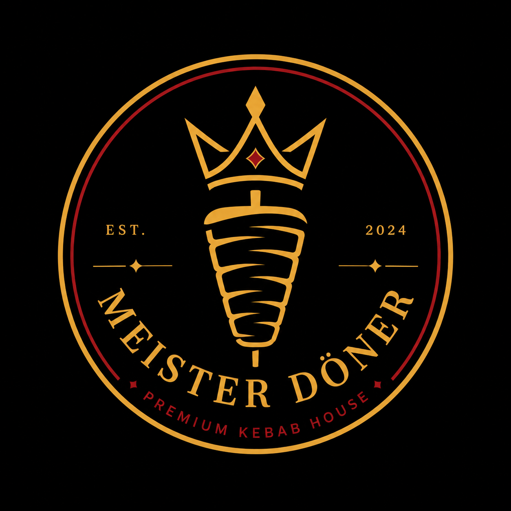

# 🌯 Meister Döner | Modern Restaurant & Food Ordering Web App

  
  
<em>Garching'in en lezzetli döner, dürüm ve wrap çeşitlerini sunan modern restoran web sitesi. / Modern restaurant web app offering delicious doner and wraps in Garching.</em>

  <!-- Badges -->
  

    
    
    
    
    
  

  

    <a href="https://merveayliz.github.io/D-NERC-/">🌐 <strong>Canlı Önizleme / Live Demo</strong></a>
  

---

## 📖 Hakkında / About
**TR:** Almanya'nın Garching bölgesindeki bir restoran için tasarlanmış modern, şık ve tamamen duyarlı (responsive) bir web arayüzüdür. Kullanıcıların günlük taze hazırlanan menüleri incelemesini ve online sipariş kanallarına kolayca ulaşmasını sağlar.

**EN:** A modern, sleek, and fully responsive web interface designed for a restaurant in Garching, Germany. It allows users to explore freshly prepared daily menus and easily access online delivery channels.

---

## ✨ Özellikler / Key Features
- 🍔 **Zengin Menü / Rich Menu:** Özel wrap'ler, dürüm menüleri, vegan seçenekler ve içecekler. / Special wraps, dürüm menus, vegan options, and drinks.
- 📱 **Alt Navigasyon / Bottom Navigation:** Mobil cihazlar için özel hızlı erişim barı. / Quick-access bar optimized for mobile devices.
- 🛵 **Online Sipariş / Online Ordering:** Lieferando ve Wolt entegrasyonu. / Direct links to popular delivery platforms.
- 📍 **Harita Entegrasyonu / Map Integration:** Google Maps ve Apple Maps ile kolay rota. / Easy route planning with map services.
- 🎨 **Modern UI:** Estetik kart yapısı ve iştah açıcı görsel sunum. / Aesthetic card layout and appetizing visual presentation.

---

## 🛠️ Kullanılan Teknolojiler / Tech Stack
* **HTML5** (Semantik yapı / Semantic structure)
* **CSS3** (Flexbox/Grid & Responsive Design)
* **JavaScript** (Dinamik etkileşimler / Dynamic interactions)
* **Google Fonts & Font Awesome** (Tipografi ve İkonlar / Typography & Icons)

---
